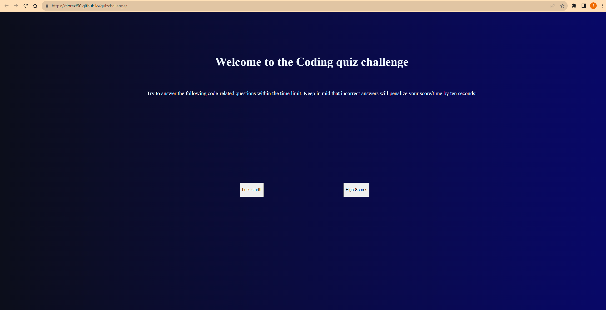

# florezf90 JavaScript quiz 

# Description

This project was a lightweight javascript-based quiz taker, created with the objective of practicing personal JavaScript and DOM interactivity skills

## Built With

This application was built with JavaScript, HTML & CSS

## USAGE

To fully appreciate the operation of the application, please try different inputs, take the quiz multiple times, also, refer to the  HTML, CSS, JavaScript files, and open the Chrome DevTools by pressing: Option + ⌘ + J (on macOS), or Shift + CTRL + J (on Windows/Linux).

## credits

Provided JS techniques: 

https://www.youtube.com/@WebDevSimplified

Provided JS clarification:

https://www.w3schools.com/jsref/prop_win_localstorage.asp

## live deployment link 

https://florezf90.github.io/quizchallenge/

## Screenshot

## License

[MIT](https://choosealicense.com/licenses/mit/)